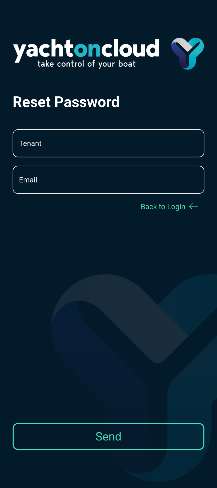
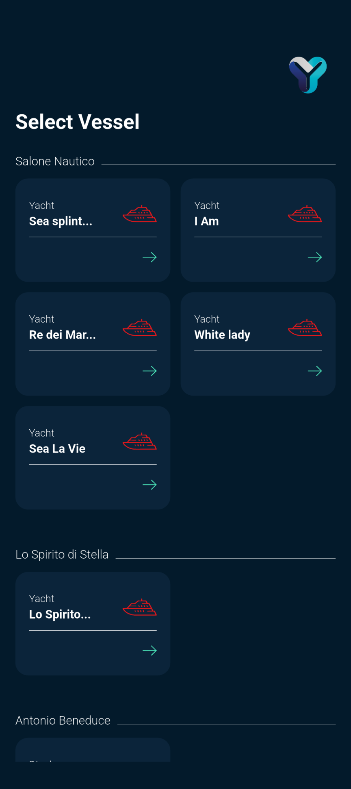
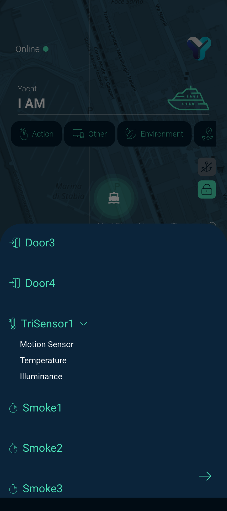
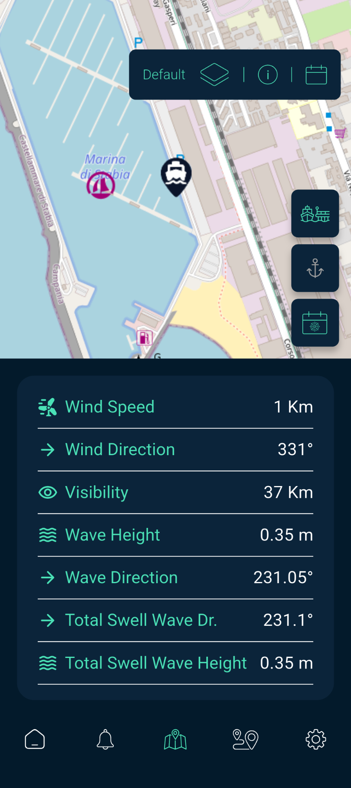
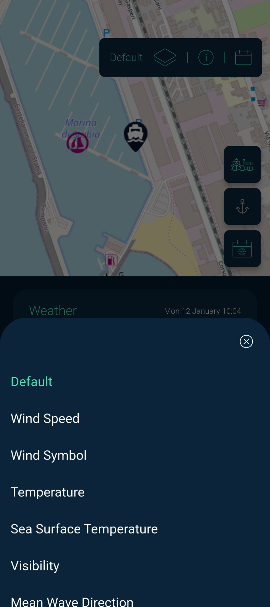
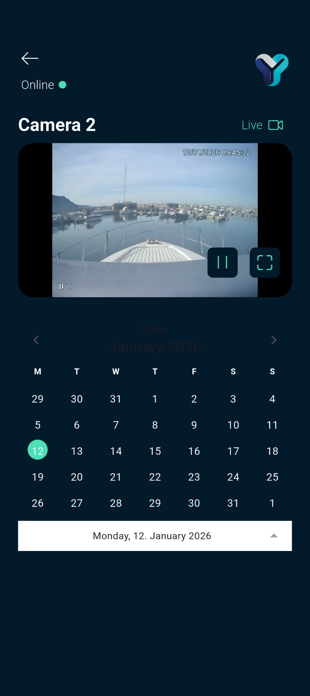

# Welcome to Yacht On Cloud user guide.

## Login
Per effettuare il log-in è obbligatorio l’inserimento nei form dei seguenti campi: 

* `Tenant`: Nome identificativo dello specifico tenant abilitato.
* `Email`: La propria e-mail che rappresenta la chiave univoca dell’utente.
* `Password`: La propria password.

    

Dopo aver riempito i campi sarà possibile cliccare sul tasto `Log In`.

In caso di credenziali errate l'utente verrà informato con un messaggio di errore.

In caso di credenziali corrette l'utente passerà alla prossima schermata.

### Reset Password
Per effettuare il reset della password è obbligatorio l’inserimento nei form dei seguenti campi: 

* `Tenant`: Nome identificativo dello specifico tenant abilitato.
* `Email`: La propria e-mail che rappresenta la chiave univoca dell’utente.

    

Verrà inviata una email all'indirizzo fornito per effettuare il reset. 

## Selezione del Vessel

In questa schermata l'utente avrà la possibilità di visualizzare i propri `Vessel`, registrati all'interno del sistema.

Se per un determinato customer è presente un solo vessel, questo verrà selezionato automaticamente subito dopo la schermata di login. Nel caso in cui siano disponibili più customer, l’utente potrà scorrerli e selezionare il vessel desiderato.

    
    

Il colore dell'icona `verde` o `grigia` indicherà rispettivamente un'imbarcazione online (raggiungibile) o offline (non raggiungibile). 

## Vessel Dashboard

    

### Indicatori di Stato e Campi Informativi
*Online/Offline*: Indicatore testuale e cromatico (punto verde) che segnala lo stato di connessione dello yacht al cloud.

*Yacht Name*: Campo che visualizza il nome dell'imbarcazione attualmente selezionata (es. "I AM").

*Mappa di Sfondo*: Visualizzazione cartografica che mostra la posizione GPS in tempo reale dello yacht.

*Tile dei Sensori/Dispositivi*: Griglia di riquadri colorati che riportano il nome del dispositivo (es. Door1, Smoke1), lo stato attuale (Open/Closed, OK, lux) e un'icona identificativa. I colori indicano lo stato di allerta (Verde per OK/Chiuso, Rosso per Aperto/Allarme).

### Azioni e Controlli
*Filtri Categoria* (Action, Other, Environment, ecc.): Pulsanti situati nella parte superiore per filtrare la visualizzazione dei dispositivi IoT in base alla loro funzione.

*Quick Actions Laterali*:

- Icona Ancora: Attivazione/disattivazione dell'allarme ancora.

- Icona Lucchetto: Comando per il blocco o sblocco centralizzato degli accessi.

*Edit*: Pulsante con icona matita per personalizzare la disposizione o la selezione delle tile nella dashboard.

*Barra di Navigazione Inferiore*:

- Home (Icona Casa): Ritorno alla dashboard principale.

- Notifiche (Icona Campanella): Accesso allo storico degli avvisi e degli allarmi.

- Mappa (Icona Mappa Aperta): Visualizzazione della cartografia a schermo intero.

- Geofencing (Icona Segnaposto): Accesso alle impostazioni dei perimetri di sicurezza geografica.

- Impostazioni (Icona Ingranaggio): Accesso alla configurazione del profilo e dell'app.

### Modalità di Edit

    

#### Campi e Indicatori
*Tile dei Dispositivi*: Ogni riquadro visualizza il nome del sensore, l'icona e lo stato attuale.

*Check di Selezione*: In questa modalità, ogni tile presenta un check circolare in alto a destra. Se il check è selezionato, il dispositivo rimarrà visibile nella dashboard; deselezionandolo, il dispositivo verrà rimosso dalla visualizzazione principale.

#### Azioni e Controlli
*Drag & Drop (Trascina e Rilascia)*: L'utente può riordinare i dispositivi sulla griglia trascinando le tile nella posizione desiderata.

*Selezione/Deselezione*: Cliccando su una tile, l'utente decide se includere o escludere quel sensore dalla propria dashboard personalizzata.

*Add All*: Comando per aggiungere contemporaneamente tutti i dispositivi disponibili alla dashboard.

*Add Device*: Pulsante per accedere alla selezione dei singoli dispositivi IoT da monitorare.

*Apply*: Pulsante per confermare definitivamente le modifiche all'ordine e alla selezione (inclusione/rimozione) dei dispositivi.

#### Aggiunta e Configurazione dei Dispositivi
Una lista a scorrimento che mostra tutti i sensori disponibili (es. Door, TriSensor, Smoke) identificati da un'icona e dal nome.
Per i dispositivi che monitorano più parametri viene visualizzato un sottomenu che elenca le specifiche misurazioni disponibili.

    
    

**Azioni e Controlli**

- *Selezione Dispositivo*: L'utente può scorrere la lista e selezionare il sensore da aggiungere alla Dashboard.

- *Espansione Sottomenu*: Cliccando su un dispositivo multi-valore (indicato da una freccia accanto al nome), l'utente può espandere la lista dei dettagli per scegliere quale valore specifico mostrare nella tile della Dashboard.

- *Chiusura (X)*: Pulsante in alto a destra per chiudere il pannello di selezione e tornare alla modalità di editing precedente.

- *Conferma Selezione*: L'icona a forma di freccia in basso a destra permette di procedere con l'inserimento del parametro scelto.

## Dettagli Dispositivo

In questa sezione viene descritta la schermata di dettaglio di un singolo dispositivo, che fornisce informazioni approfondite sul suo stato e sulla cronologia degli eventi.

**Campi e Indicatori Informativi**

- *Stato Connessione Yacht*: In alto a sinistra è indicato lo stato "Online" dell'imbarcazione con il relativo indicatore cromatico.

- *Nome Yacht*: Identifica l'imbarcazione su cui è installato il sensore (es. "I AM").

- *Categoria Dispositivo*: Indica la tipologia di appartenenza del sensore (es. "Security").

- *Nome e ID Dispositivo*: Visualizza il nome assegnato al sensore (es. "Door1").

- *Stato Attuale*: Mostra la condizione del sensore in tempo reale (es. "Closed" o "Open") accompagnata da un'icona che ne indica lo stato di alimentazione o connessione.

- *Ultimo Aggiornamento (Latest)*: Indica la data e l'ora dell'ultima lettura ricevuta dal sensore (es. "14.11.2025 13:43").

- *Ultimo Allarme (Last Alarm)*: Specifica la data e l'ora dell'ultimo evento di allarme registrato (es. "14.11.2025 13:09").

**Azioni e Controlli**

- *Pulsante Indietro (Freccia)*: Situato in alto a sinistra, permette di tornare alla Dashboard principale.

- *Historic*: Sezione selezionabile che consente l'accesso alla cronologia completa degli stati e degli eventi registrati dal dispositivo nel tempo.

- *Click sul dettaglio*: Consente di aprire la sezione della cronologia completa degli stati e degli eventi registrati dal dispositivo nel tempo.

### 1. Door

La schermata *Door* serve per monitorare lo stato delle porte, se essa siano aperta o chiusa.

`Verde` indica che la porta è chiusa, `Rosso` indica che la porta è aperta.

    

### 2. Tri-Sensor

La schermata *Tri-Sensor* serve per monitorare i 3 sensori: `Motion Sensor`, `Temperature` e `Illuminance`.

    

* **Motion Sensor** = Percepisce i movimenti all'interno di un raggio d'azione.
* **Temperature** = Misura la temperatura dell'imbarcazione.
* **Illuminance** = Misura la quantità di *Luce* presente.

### 3. Smoke

La schermata *Smoke* serve per rilevare la presenza di fumo. 

Come per la *Door* anche i colori sono i medesimi di conseguenza `Verde` indica che non c'è presenza di fumo, `Rosso` indica presenza di fumo. 

    

### 4. Actuator

Gli *Actuator* permettono di controllare lo stato delle luci all'interno dell'imbarcazione.

Gli switch indicano se la luce sia o meno spenta, in base al colore attivo/non attivo.

Azionando lo switch, questo cambierà colore ed effettivamente le luci all'interno dell'imbarcazione si comporteranno di conseguenza.

Il valore `ON` e `OFF` indicato sotto alle diciture *Line*, è un ulteriore avviso sull'attuale stato delle luci.

### 5. Siren

La schermata *Siren* permette di controllare lo stato della sirena in caso stia suonando o meno.

Anche qui i colori sono gli stessi per la door. 

    

### 6. Engine

La schermata *Engine* permette di controllare i valori riguardanti il motore dell'imbarcazione.

    

Al suo interno sono presenti diversi valori:

* `Fuel Rate` = Permette di monitorare il tasso di consumo del carburante.
* `Total Hours` = Permette di monitorare le ore di funzionamento del motore.
* `Load` = Permette di monitorare il carico del motore. 
* `Oil Pressure` = Permette di monitorare la pressione dell'olio. 
* `Engine Speed` = Permette di monitorare la velocità indicata in **giri** al minuto.
* `Throttle` = Permette di monitorare la percentuale di accelerazione richiesta dal conducente.

### 7. Navigation Page

La schermata *Navigation* permette di controllare tutti i dati riguardanti la navigazione.

Come per Engine anche qui abbiamo diversi valori: 

* `Latitude` = Permette di visualizzare la latitudine.
* `Longitude` = Permette di visualizzare la longitudine.
* `Depth` = Permette di monitorare il livello di prodondità.
* `Heading` = Permette di visualizzare la direzione del muso della propria imbarcazione.
* `Rudder` = Permette di monitorare il ratio tra la velocità e l'angolo del timone. 
* `Speed over the Ground` = Permette di monitorare la velocità dell'imbarcazione rispetto alla superficie terrestre.

### 8. Meteo Page

La schermata *Meteo* permette di monitorare le condizioni atmosferiche secondo dati nautici.

Anche qui avremo diversi valori a disposizione: 

* `Wind Direction` = Permette di monitorare la direzione da cui soffia il vento.
* `Wind Speed` = Permette di monitorare la velocità media del vento.
* `Outside Temperature` = Permette di monitorare la corretta temperatura esterna.
* `Outside Humidity` = Permette di monitorare la corretta umidità esterna.
* `Atmosphere Pressure` = Permette di monitorare la pressione atmosferica.

### 9. Battery Page

La schermata *Battery* consente di monitorare in tempo reale i valori della batteria del motore.

### 10. History

La *History* permette di poter visualizzare lo storico delle `telemetrie` di un dispositivo. 

### Campi e Indicatori Comuni

- *Nome della Metrica/Sensore*: Titolo in alto a sinistra che identifica il dato monitorato (es. fuelRate o Door1).

- *Intervallo Temporale*: Indica il periodo analizzato tramite le date di inizio (from) e di fine (to).

- *Nota di Campionamento*: Didascalia inferiore che specifica la densità dei dati mostrati (es. "Only the last 24 values shown").

    
    

### Grafico Lineare (Dati Continui)

Utilizzato per parametri numerici che variano nel tempo, come il consumo di carburante (fuelRate).

Andamento Dinamico: Una linea continua mostra le fluttuazioni del valore.

Valori di Scala: L'asse verticale riporta i valori puntuali minimi e massimi registrati nel periodo (es. da 33.8 lt/h a 41.9 lt/h).

### Grafico a Punti (Stati Discreti/Eventi)

Utilizzato per sensori binari o di stato, come i sensori porta (Door).

Rilevazione Eventi: Il grafico mostra punti isolati in corrispondenza di ogni cambio di stato o rilevazione effettuata.

Asse degli Stati: L'asse verticale indica lo stato o il numero di eventi, mentre l'asse orizzontale riporta le date specifiche delle occorrenze.

L'ultima rappresentazione ci viene mostrata nel momento in cui non abbiamo telemetrie negli ultimi 7 giorni. 

### Azioni e Controlli

- *Edit (Icona Calendario)*: Consente di modificare l'intervallo temporale per consultare dati storici di periodi differenti.

- *Chiusura (X)*: Pulsante in alto a destra per chiudere il popup della cronologia e tornare alla schermata di dettaglio.

Sopra al grafico o al messaggio che ci avvisa di non aver trovato dati recenti, vi sono delle indicazioni che riguardano il dispositivo, il range di giorni in cui recuperare i valori e il tempo di aggregazione. *Questi sono valori di default*

Cliccando sul bottone in alto a destra *History Filter*, vi è la possibilità anche di impostare dei filtri per una migliore gestione di visualizzazione dei dati. 

E' possibile in questo modo decidere il range di giorni e filtrare i dati per quel range, di default la modalità di aggregazione sarà *DAILY*. 

Spuntando la casella *Advanced Mode* avremo a disposizione dei filtri avanzati. 

In questo modo potremmo modificare alcuni dati tra cui: Retrieved Data, Aggregation Time, Aggregation Function. 

Esistono vari tipi di funzioni di aggregazione:

* **AVG**
* **MAX**
* **MIN**
* **COUNT**
* **SUM**

Inoltre dove è possibile, in caso di più valori in un singolo device, è possibile anche scegliere quale telemetria vogliamo analizzare.

## Dashboard Allarmi

All'interno del `Menu Principale`, cliccando sull'apposita icona (rappresentata da una **sveglia**), è possibile visualizzare un elenco degli ultimi allarmi scattati.

Dalla dashboard possiamo capire quale dispositivo ha fatto scattare un allarme indicando data e orario. 

    

Vi è la possibilità cliccando sull'allarme di andare a visualizzare il device responsabile per i dettagli.

### 1. Notifiche Allarme

Al momento della ricezione di un allarme, l'utente verrà informato tramite una notifica sul proprio dispositivo mobile.

La notifica presenterà le seguenti informazioni: 

* Categoria del dispositivo: Safety, Security, Anchor.
* Nome Dispositivo. 
* Data e ora.

Mentre l'app è aperta verrà mostrata una notifica pop-up con le informazioni dell’allarme.

Nella modale saranno presenti due `pulsanti`, uno per accedere al dettaglio del sensore collegato all’evento allarmante e un pulsante che consente di armare o disarmare.

In base alla tipologia dell'errore la modale avrà delle funzionalità differenti. 

Se l'evento allarmante è un sensore specifico ci sarà la possibiità di accedere al dettaglio del sensore collegato all’allarme e un pulsante che consente di armare o disarmare.

Se l'evento allarmante riguarda il GPS, comparirà la possibilità di accedere alla pagina tracking. 

Nel caso di allarme `Security` apparirà anche la possibilità di eseguire lo sblocco dell’armatura, altresì nel caso di allarme di tipo `Anchor` il pulsante per la disattivazione dell’ancora. 

## Tracking

All'interno del `Menu Principale`, cliccando sull'apposita icona (rappresentata da una **Mappa**), è possibile attivare il tracking in tempo reale della propria imbarcazione e le informazioni meteo.

    
    

Cliccando sull'icona della propria imbarcazione sarà possibile visualizzare alcuni dati come la Latitudine e la Longitudine del luogo in cui si trova in quel momento l'imbarcazione.

In questa sezione abbiamo diverse funzionalità, tutte corrisposte da un apposito pulsante e che descriveremo nel dettaglio.

### 1. Virtual Anchor

Cliccando sul pulsante *Virtual Anchor* è possibile attivare l’ancora virtuale. Nella relativa schermata è inoltre disponibile una legenda che ne illustra il funzionamento.

    

Se attiva, crea una circonferenza attorno all’imbarcazione e quando l’imbarcazione si sposta più del raggio selezionato dalla circonferenza scatterà un allarme.

### 2. Tracking History

Cliccando sull'apposito pulsante *Tracking History* è possibile visionare i movimenti dell’imbarcazione in un determinato giorno selezionabile da un calendario.

### 3. Layer

Cliccando sul pulsante *Layer* è possibile selezionare il livello di informazioni da visualizzare sulla mappa. I layer disponibili sono:

* `Default`: Vista standard della mappa.
* `Wind Speed`: Velocità del vento in tempo reale.
* `Wind Symbol`: Direzione e intensità del vento rappresentate da simboli.
* `Temperature`: Temperatura dell’aria.
* `Sea Surface Temperature`: Temperatura superficiale del mare.
* `Visibility`: Livello di visibilità stimata.
* `Mean Wave Direction`: Direzione media delle onde.
* `Significant Wave Height`: Altezza significativa delle onde.
* `Wind Waves`: Altezza delle onde generate dal vento.
* `Wind Wave Directions`: Direzione delle onde generate dal vento.

    

Nella parte inferiore della schermata sono presenti altri due pulsanti, sempre relativi ai layer:

1 - Date: Consente di selezionare una data specifica per visualizzare le informazioni relative al layer scelto.

2 - Info: Permette di aprire una legenda che aiuta a interpretare correttamente i diversi layer.

### 4. Meteo

In questa sezione sono contenute tutte le informazioni relative alle condizioni meteo orarie e del dettaglio marino del servizio [DTN](https://devportal.dtn.com/catalog).

Di seguito un elenco di tutte i dati che possiamo trovare nel dettaglio:

* `Hourly Forecast`: Viene presentato come un widget scrollabile lateralmente ed indica le previsioni meteo della giornata.
* `Sea Surface Temperature`: Temperatura della superficie del mare.
* `Air Pressure`: Pressione dell'aria.
* `Wind Speed`: Velocità del vento misurato in km.   
* `Wind Direction`: Direzione del vento misurato in gradi.
* `Visibility`: Tasso di visibilità misurato in km. 
* `Wave Height`: Misura della grandezza delle onde.
* `Wave Direction`: Direzione delle onde misurata in gradi.
* `Total Swell Wave Direction`: Direzione totale del moto delle onde misurato in gradi.
* `Total Swell Wave Height`: Altezza totale del moto delle onde.

### 5. Ports

Cliccando sul pulsante Ports è possibile visualizzare i porti più vicini all’imbarcazione. Selezionando un porto specifico, vengono mostrati i seguenti dati informativi, se disponibili: `nome`, `canale radio`, `coordinate` e `numero di telefono della capitaneria di porto`.

    
    

## Impostazioni
L'ultimo bottone presente all'interno del `Menu Principale`, rappresentato dall'icona di un **Ingranaggio**, è quello per i *Settings*.

    

Cliccato l'apposito pulsante si aprirà un menu.

In questa pagina l'utente avrà accesso a diverse opzioni relative alle impostazioni dell'applicazione. 

### 1. Profile Page

In questa pagina l’utente potrà visualizzare le proprie informazioni quali `tenant`, `customer`, `username`, `email`, `nome` e `cognome` dell’account.

    

È possibile modificare l’immagine di profilo cliccando sull’apposito pulsante. Verrà aperto un menu che consente di selezionare una foto dall’archivio del dispositivo oppure di scattarne una nuova.

### 2. Settings Page

In questa pagina l’utente potrà visualizzare tutte le impostazioni dell’app: vibrazione, suoneria.

    

### 3. Change Pin

Cliccando su *Change Pin* si aprirà la schermata dove sarà possibile cambiare il pin per poter armare e disarmare l'imbarcazione.

Inizialmente viene dato un pin di *default* che è consigliabile cambiare il prima possibile e crearne uno personalizzato per una maggiore sicurezza.

    

### 4. Change Password for Wi-Fi

Cliccando su *Change Password for Wi-Fi* si apre la schermata dedicata, dalla quale è possibile modificare la password della rete Wi-Fi del dispositivo pixora-edge, utilizzata per la connessione a Internet.

    

### 5. Change Boat

Cliccando sul bottone *Change Boat* si verrà riportati alla sezione dove è possibile selezionare un'altra imbarcazione tra quelle in possesso.

### 6. Logout

Cliccando su Logout l'utente verrà riportato alla schermata di Login dove potrà inserire di nuovo le credenziali di accesso. 

## TLC

All'interno della `Dashboard` è possibile, cliccando sull'apposito dispositivo TLC, visualizzare una lista di tutte le proprie telecamere.

    

Ciò che l'utente vedrà in questa schermata sarà l'ultimo `Snapshot` effettuato da ogni telecamera.

Cliccando su una delle telecamere a disposizione si verrà reindirizzati nella schermata di dettaglio di quella specifica telecamera.

    

La schermata di presenterà con un video `live` della telecamera selezionata, con possibilità di azionare il *Fullscreen*, facendo click sul pulsante a destra, o mettere in *Pausa* e poi riprendere dall'istante attuale.

Al di sotto della diretta, tramite un calendario è possibile controllare tutte le registrazioni catturate dagli allarmi scattati per quella specifica data. *Il calendario sarà scrollabile lateralmente per cambiare il mese di selezione*.

I giorni selezionabili sul calendario avranno diversi colori: 

* `Azzurro` = Giorno attuale.
* `Rosso` = Giorno in cui sono presenti delle registrazioni.
* `Grigio` = Giorno in cui non sono presenti alcune registrazioni.

Cliccando su un giorno in cui è presente un `evento`, Comparirà un elenco di allarmi corrispondenti al device incriminato. Cliccando sull'evento, si procede all'avvio del `Playback` della registrazione per il canale stream tlc corrente. 

In questo modo la dicitura evidenziata in verde ***Live*** presente in alto a destra verrà sostituita da ***VOD*** evidenziato in giallo, per indicare che il video non è più in diretta bensì si tratta di una registrazione.
