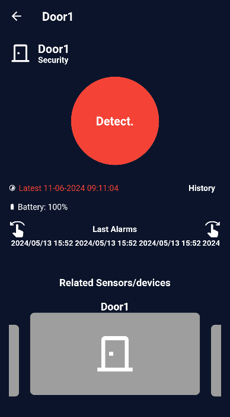
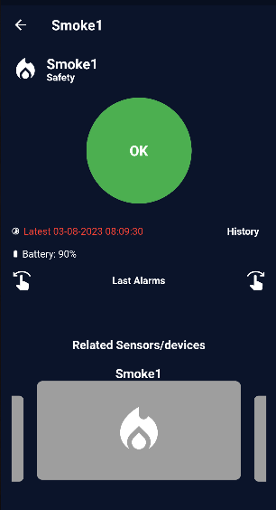
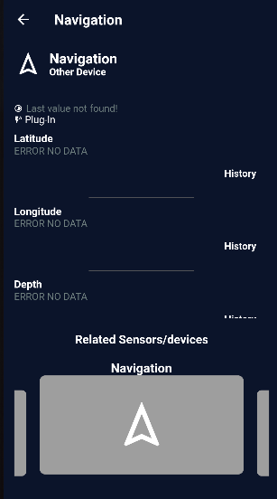
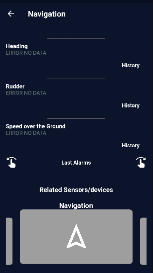
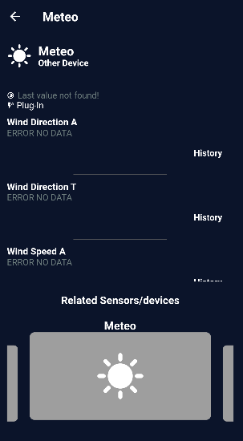
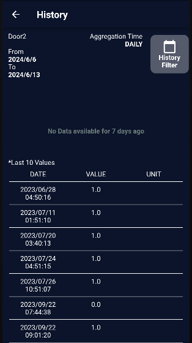
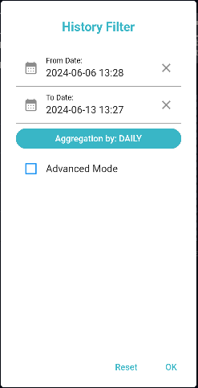
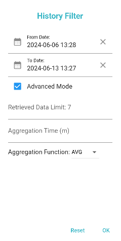
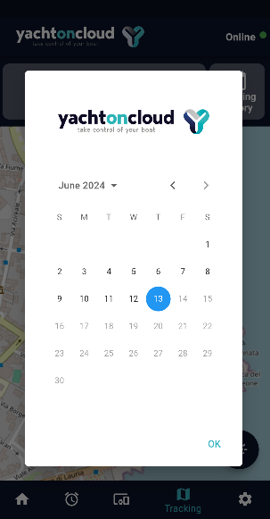
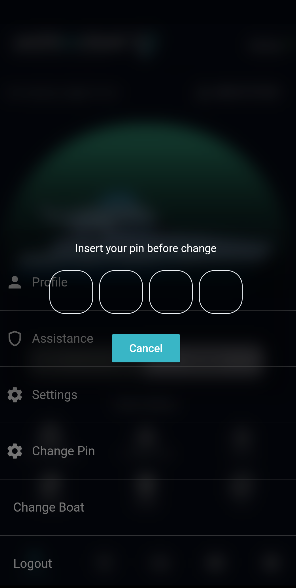

# Welcome to Yacht On Cloud user guide.

## Login Screen
Per effettuare il log-in è obbligatorio l’inserimento nei form dei seguenti campi: 

* `Tenant`: Nome identificativo dello specifico tenant abilitato.
* `Email`: La propria e-mail che rappresenta la chiave univoca dell’utente.
* `Password`: La propria password.

    

Dopo aver riempito i campi sarà possibile cliccare sul tasto `Log In`.

In caso di credenziali errate l'utente verrà informato con un messaggio di errore.

In caso di credenziali corrette l'utente passerà alla prossima schermata.

## Vessel Selection Page

In questa schermata l'utente avrà la possibilità di visualizzare i propri `Vessel`, registrati all'interno del sistema.

Se per un determinato customer è presente un solo vessel, questo verrà selezionato automaticamente subito dopo la schermata di login. Nel caso in cui siano disponibili più customer, l’utente potrà scorrerli e selezionare il vessel desiderato.

    
    

Lo sfondo `verde` o `grigio` indicherà rispettivamente un'imbarcazione online (raggiungibile) o offline (non raggiungibile). 

## Vessel Dashboard

    

### 1. Boat Info

La dashboard si presenta in questo modo. 

In alto troveremo le informazioni riguardanti l'imbarcazione: 

* Lo stato dell'imbarcazione: Se essa è raggiungibile o meno: `Online` o `Offline`.
* Il nome e la tipologia della propria imbarcazione: `Yatch`, `Catamarano` o `Dinghi`.
* Se risulta ancorata oppure no: `Moored` o `Unfastened`.

Cliccando sullo stato dell'imbarcazione si verrà reinderizzati verso la pagina di connettività. **[Vedi Connectivity Screen](#connectivity-screen)**

    
    

L'immagine centrale cambierà in base alla `tipologia` di imbarcazione di cui siamo in possesso. 

In caso l'imbarcazione sia offline lo sfondo alle spalle dell'immagine risulterà `grigio`.

In caso sia presente un evento allarmante riguardante l'imbarcazione lo sfondo alle spalle sarà `rosso`.

    
    

### 2. Menu Rapido

Al di sotto del bottone troveremo una piccola sezione `Boat Status`.

Questa sezione ha la funzione di menu' rapido, in cui è possibile visionare le informazioni relative ai Device: `Control Panel, Environment, Action, Security, Safety` e infine è possibile visionare le `Telecamere` di sicurezza presenti sull’imbarcazione. **[Vedi TLC Screen](#tlc-screen)** 

Ogni pulsante del menu rendirizzerà l'utente verso una sezione specifica di cui tratteremo in seguito.

Quando ci sarà un nuovo allarme sul pulsante `Security` apparirà un pallino rosso sull'icona.

    

All'interno di questa sezione troviamo anche altre quattro funzionalità:

1 - Il pulsante che ci permette di cambiare lo stato dell'imbarcazione da `Armed` a `Disarmed`. Questo abilita il sistema di monitoraggio e sicurezza perimetrale.
Cliccando, per armare, ci comparirà un pop-up e ci verrà richiesto il **PIN** di sicurezza. Inoltre comparirà un avviso in caso il device si trovi in stato `Triggered` (ad esempio se una porta è in stato open). *Inizialmente ci sarà un PIN di default che verrà dato al cliente, per modificare* **[Vedi 4. Change Pin](#4-change-pin)**

    
    

2 - Il pulsante `Connectivity` che consente di verificare se il dispositivo pixora-edge è connesso a Internet e, in caso positivo, di monitorare la qualità della connessione.

    

Come si può notare nel grafico è presente una scala di valori rappresentati da dei colori: 

* `Green` = Good.
* `Yellow` = Poor.
* `Red` = Bad.

In genere il valore minimo indica che non vi è alcun segnale.

Lo stato ci indica lo stato di connessione globale:

* Se almeno un valore è rosso allora lo stato è `NOCONN`. 

* Se almeno un valore è giallo allora lo stato è `POOR`.

* Se almeno un valore è verde allora lo stato è `GOOD`.

3 - Il pulsante `Routes` che mostra lo storico delle rotte percorse dall’imbarcazione. Selezionando una rotta specifica è possibile aprirne il dettaglio completo.

    
    

4 - Il pulsante `SOS`, da utilizzare esclusivamente in caso di emergenza, che consente di contattare direttamente i soccorsi selezionando il contatto desiderato.

    

### 3. Menu Principale

Infine abbiamo il menu principale dove è possibile navigare tra Home – Allarmi – Devices – Mappa – Impostazioni.

In breve: 

* `Home`: Permette di ritornare alla sezione Dashboard principale.
* `Alarm`: Permette di spostarsi nella sezione allarmi dove si potrà visualizzare lo storico degli allarmi attivati.
* `Devices`: Permette di spostarsi nella sezione dove si avrà accesso alla lista di tutti i dispositivi.
* `Map`:  Permette di spostarsi nella sezione dove sarà possibile visualizzare la mappa.
* `Settings`: Permette di spostarsi nella sezione di impostazioni del sistema.

    

*Queste sezioni verranno discusse in seguito in dettaglio.*

## Dashboard Devices

Abbiamo due modi per poter visualizzare i dispositivi disponibili per la nostra imbarcazione: utilizzare il `Menu Rapido` per andare ad analizzare la macrocategoria di dispositivi a cui siamo interessati, oppure utilizzare il `Menu Principale` e cliccare sul pulsante "Devices" (raffigurato da un icona apposita) in questo modo avremo una schermata con tutti i dispositivi.

Cliccando sull'icona per visualizzare tuti i dispositivi avremo una schermata scorrevole.

    
    

Ogni card che troviamo in questa schermata corrisponde ad un device, ogni device ha la sua pagina con i relativi dettagli.

Nella pagina di dettaglio del sensore verranno rappresentati in lista tutte le metriche associate ad un dato sensore. 

Accanto a ciascuna telemetria un pulsante consentirà di accedere alla sezione *History* per la visualizzazione tutte le telemetrie per una più completa ricerca. **[(Vedi History Page)](#10-history-page)**.

Infine un **carosello** a pié di pagina serve per spostarsi velocemente tra dispositivi della stessa categoria.

*Questi funzionamenti sono uguali per tutti i dispositivi.*

### 1. Door Page

La schermata *Door* serve per monitorare lo stato delle porte, se essa siano aperta o chiusa.

`Verde` indica che la porta è chiusa, `Rosso` indica che la porta è aperta.

    
    

### 2. Tri-Sensor Page

La schermata *Tri-Sensor* serve per monitorare i 3 sensori: `Motion Sensor`, `Temperature` e `Illuminance`.

    

* **Motion Sensor** = Percepisce i movimenti all'interno di un raggio d'azione.
* **Temperature** = Misura la temperatura dell'imbarcazione.
* **Illuminance** = Misura la quantità di *Luce* presente.

Qui possiamo controllare gli ultimi valori dei sensori e la percentuale di batteria del dispositivo. 

### 3. Smoke Page

La schermata *Smoke* serve per rilevare la presenza di fumo. 

Come per la *Door* anche i colori sono i medesimi di conseguenza `Verde` indica che non c'è presenza di fumo, `Rosso` indica presenza di fumo. 

    

### 4. Actuator Page

Gli *Actuator* permettono di controllare lo stato delle luci all'interno dell'imbarcazione.

    
    

Gli switch indicano se la luce sia o meno spenta.

`Bianco` indica che la luce è spenta, mentre `Giallo` indica che la luce è accesa. 

Azionando lo switch, questo cambierà colore ed effettivamente le luci all'interno dell'imbarcazione si comporteranno di conseguenza.

Il valore `ON` e `OFF` indicato sotto alle diciture *Line*, è un ulteriore avviso sull'attuale stato delle luci.

### 5. Siren Page

La schermata *Siren* permette di controllare lo stato della sirena in caso stia suonando o meno.

Anche qui i colori sono gli stessi per la door. 

    

### 6. Engine Page

La schermata *Engine* permette di controllare i valori riguardanti il motore dell'imbarcazione.

    
    

Al suo interno sono presenti diversi valori:

* `Fuel Rate` = Permette di monitorare il tasso di consumo del carburante.
* `Total Hours` = Permette di monitorare le ore di funzionamento del motore.
* `Load` = Permette di monitorare il carico del motore. 
* `Oil Pressure` = Permette di monitorare la pressione dell'olio. 
* `Engine Speed` = Permette di monitorare la velocità indicata in **giri** al minuto.
* `Throttle` = Permette di monitorare la percentuale di accelerazione richiesta dal conducente.

### 7. Navigation Page

La schermata *Navigation* permette di controllare tutti i dati riguardanti la navigazione.

    
    

Come per Engine anche qui abbiamo diversi valori: 

* `Latitude` = Permette di visualizzare la latitudine.
* `Longitude` = Permette di visualizzare la longitudine.
* `Depth` = Permette di monitorare il livello di prodondità.
* `Heading` = Permette di visualizzare la direzione del muso della propria imbarcazione.
* `Rudder` = Permette di monitorare il ratio tra la velocità e l'angolo del timone. 
* `Speed over the Ground` = Permette di monitorare la velocità dell'imbarcazione rispetto alla superficie terrestre.

### 8. Meteo Page

La schermata *Meteo* permette di monitorare le condizioni atmosferiche secondo dati nautici.

    
    

Anche qui avremo diversi valori a disposizione: 

* `Wind Direction` = Permette di monitorare la direzione da cui soffia il vento.
* `Wind Speed` = Permette di monitorare la velocità media del vento.
* `Outside Temperature` = Permette di monitorare la corretta temperatura esterna.
* `Outside Humidity` = Permette di monitorare la corretta umidità esterna.
* `Atmosphere Pressure` = Permette di monitorare la pressione atmosferica.

### 9. Battery Page

La schermata *Battery* consente di monitorare in tempo reale i valori della batteria del motore.

    

### 10. History Page

La *History* permette di poter visualizzare lo storico delle `telemetrie` di un dispositivo. 

Generalmente nel momento in cui proviamo a visualizzare lo storico di un determinato device comparirà un grafico dove ci vengono mostrate le ultime telemetrie e il loro andamento nel tempo.

Lo storico ci viene rappresentato in tre modi differenti: 

* Grafico a barre.
* Grafico a linee o ad area.
* Tabella con valori.

    
    

L'ultima rappresentazione ci viene mostrata nel momento in cui non abbiamo telemetrie negli ultimi 7 giorni. 

    

Sopra al grafico o al messaggio che ci avvisa di non aver trovato dati recenti, vi sono delle indicazioni che riguardano il dispositivo, il range di giorni in cui recuperare i valori e il tempo di aggregazione. *Questi sono valori di default*

Cliccando sul bottone in alto a destra *History Filter*, vi è la possibilità anche di impostare dei filtri per una migliore gestione di visualizzazione dei dati. 

    

Come si può vedere dall'immagine, è possibile in questo modo decidere il range di giorni e filtrare i dati per quel range, di default la modalità di aggregazione sarà *DAILY*. 

Spuntando la casella *Advanced Mode* avremo a disposizione dei filtri avanzati. 

    

In questo modo potremmo modificare alcuni dati tra cui: Retrieved Data, Aggregation Time, Aggregation Function. 

Esistono vari tipi di funzioni di aggregazione:

* **AVG**
* **MAX**
* **MIN**
* **COUNT**
* **SUM**

Inoltre dove è possibile, in caso di più valori in un singolo device, è possibile anche scegliere quale telemetria vogliamo analizzare.

## Alarms Dashboard

All'interno del `Menu Principale`, cliccando sull'apposita icona (rappresentata da una **sveglia**), è possibile visualizzare un elenco degli ultimi allarmi scattati.

Dalla dashboard possiamo capire quale dispositivo ha fatto scattare un allarme indicando data e orario. 

    

Vi è la possibilità cliccando sull'allarme di andare a visualizzare il device responsabile per i dettagli.

### 1. Notifiche Allarme

Al momento della ricezione di un allarme, l'utente verrà informato tramite una notifica sul proprio dispositivo mobile.

La notifica presenterà le seguenti informazioni: 

* Categoria del dispositivo: Safety, Security, Anchor.
* Nome Dispositivo. 
* Data e ora.

Mentre l'app è aperta verrà mostrata una notifica pop-up con le informazioni dell’allarme.

Nella modale saranno presenti due `pulsanti`, uno per accedere al dettaglio del sensore collegato all’evento allarmante e un pulsante che consente di armare o disarmare.

    

In base alla tipologia dell'errore la modale avrà delle funzionalità differenti. 

Se l'evento allarmante è un sensore specifico ci sarà la possibiità di accedere al dettaglio del sensore collegato all’allarme e un pulsante che consente di armare o disarmare.

Se l'evento allarmante riguarda il GPS, comparirà la possibilità di accedere alla pagina tracking. 

Nel caso di allarme `Security` apparirà anche la possibilità di eseguire lo sblocco dell’armatura, altresì nel caso di allarme di tipo `Anchor` il pulsante per la disattivazione dell’ancora. 

## Tracking Page

All'interno del `Menu Principale`, cliccando sull'apposita icona (rappresentata da una **Mappa**), è possibile attivare il tracking in tempo reale della propria imbarcazione.

    
    

Cliccando sull'icona della propria imbarcazione sarà possibile visualizzare alcuni dati come la Latitudine e la Longitudine del luogo in cui si trova in quel momento l'imbarcazione.

In questa sezione abbiamo diverse funzionalità, tutte corrisposte da un apposito pulsante e che descriveremo nel dettaglio.

### 1. Virtual Anchor

Cliccando sul pulsante *Virtual Anchor* è possibile attivare l’ancora virtuale. Nella relativa schermata è inoltre disponibile una legenda che ne illustra il funzionamento.

    
    

Se attiva, crea una circonferenza attorno all’imbarcazione e quando l’imbarcazione si sposta più del raggio selezionato dalla circonferenza scatterà un allarme.

### 2. Tracking History

Cliccando sull'apposito pulsante *Tracking History* è possibile visionare i movimenti dell’imbarcazione in un determinato giorno selezionabile da un calendario.

    

### 3. Layer

Cliccando sul pulsante *Layer* è possibile selezionare il livello di informazioni da visualizzare sulla mappa. I layer disponibili sono:

* `Default`: Vista standard della mappa.
* `Wind Speed`: Velocità del vento in tempo reale.
* `Wind Symbol`: Direzione e intensità del vento rappresentate da simboli.
* `Temperature`: Temperatura dell’aria.
* `Sea Surface Temperature`: Temperatura superficiale del mare.
* `Visibility`: Livello di visibilità stimata.
* `Mean Wave Direction`: Direzione media delle onde.
* `Significant Wave Height`: Altezza significativa delle onde.
* `Wind Waves`: Altezza delle onde generate dal vento.
* `Wind Wave Directions`: Direzione delle onde generate dal vento.

    
    
    

Nella parte inferiore della schermata sono presenti altri due pulsanti, sempre relativi ai layer:

1 - Date: Consente di selezionare una data specifica per visualizzare le informazioni relative al layer scelto.

2 - Info: Permette di aprire una legenda che aiuta a interpretare correttamente i diversi layer.

### 4. Weather Screen

In questa sezione sono contenute tutte le informazioni relative alle condizioni meteo orarie e del dettaglio marino del servizio [DTN](https://devportal.dtn.com/catalog).

    
    

Di seguito un elenco di tutte i dati che possiamo trovare nella pagina:

* `Hourly Forecast`: Viene presentato come un widget scrollabile lateralmente ed indica le previsioni meteo della giornata.
* `Sea Surface Temperature`: Temperatura della superficie del mare.
* `Air Pressure`: Pressione dell'aria.
* `Wind Speed`: Velocità del vento misurato in km.   
* `Wind Direction`: Direzione del vento misurato in gradi.
* `Visibility`: Tasso di visibilità misurato in km. 
* `Wave Height`: Misura della grandezza delle onde.
* `Wave Direction`: Direzione delle onde misurata in gradi.
* `Total Swell Wave Direction`: Direzione totale del moto delle onde misurato in gradi.
* `Total Swell Wave Height`: Altezza totale del moto delle onde.

### 5. Ports Screen

Cliccando sul pulsante Ports è possibile visualizzare i porti più vicini all’imbarcazione. Selezionando un porto specifico, vengono mostrati i seguenti dati informativi, se disponibili: `nome`, `canale radio`, `coordinate` e `numero di telefono della capitaneria di porto`.

    

## Settings Screen
L'ultimo bottone presente all'interno del `Menu Principale`, rappresentato dall'icona di un **Ingranaggio**, è quello per i *Settings*.

    

Cliccato l'apposito pulsante si aprirà un menu.

In questa pagina l'utente avrà accesso a diverse opzioni relative alle impostazioni dell'applicazione. 

### 1. Profile Page

In questa pagina l’utente potrà visualizzare le proprie informazioni quali `tenant`, `customer`, `username`, `email`, `nome` e `cognome` dell’account.

    
    

È possibile modificare l’immagine di profilo cliccando sull’apposito pulsante. Verrà aperto un menu che consente di selezionare una foto dall’archivio del dispositivo oppure di scattarne una nuova.

### 2. Settings Page

In questa pagina l’utente potrà visualizzare tutte le impostazioni dell’app: vibrazione, suoneria e inoltre potrà personalizzare l’immagine della propria barca.

    
    

Cliccando sul pulsante al di sotto dell'immagine dell'imbarcazione, si aprirà un menu che consente di selezionare una foto dall’archivio del dispositivo oppure di scattarne una nuova.

### 3. Change Pin

Cliccando su *Change Pin* si aprirà la schermata dove sarà possibile cambiare il pin per poter armare e disarmare l'imbarcazione.

Inizialmente viene dato un pin di *default* che è consigliabile cambiare il prima possibile e crearne uno personalizzato per una maggiore sicurezza.

    

### 4. Change Password for Wi-Fi

Cliccando su *Change Password for Wi-Fi* si apre la schermata dedicata, dalla quale è possibile modificare la password della rete Wi-Fi del dispositivo pixora-edge, utilizzata per la connessione a Internet.

    

### 5. Change Boat

Cliccando sul bottone *Change Boat* si verrà riportati alla sezione dove è possibile selezionare un'altra imbarcazione tra quelle in possesso.

### 6. Logout

Cliccando su Logout l'utente verrà riportato alla schermata di Login dove potrà inserire di nuovo le credenziali di accesso. 

## TLC Screen

All'interno del `Menu Rapido` è possibile, cliccando sull'apposita icona (rappresentata da un **Media Player**), visualizzare una lista di tutte le proprie telecamere.

    

Ciò che l'utente vedrà in questa schermata sarà l'ultimo `Snapshot` effettuato da ogni telecamera.

Cliccando su una delle telecamere a disposizione si verrà reindirizzati nella schermata di dettaglio di quella specifica telecamera.

    

La schermata di presenterà con un video `live` della telecamera selezionata, con possibilità di azionare il *Fullscreen*, facendo click sul pulsante a destra, o mettere in *Pausa* e poi riprendere dall'istante attuale.

Al di sotto della diretta, tramite un calendario è possibile controllare tutte le registrazioni catturate dagli allarmi scattati per quella specifica data. *Il calendario sarà scrollabile lateralmente per cambiare il mese di selezione*.

I giorni selezionabili sul calendario avranno diversi colori: 

* `Azzurro` = Giorno attuale.
* `Rosso` = Giorno in cui sono presenti delle registrazioni.
* `Grigio` = Giorno in cui non sono presenti alcune registrazioni.

Cliccando su un giorno in cui è presente un `evento`, Comparirà un elenco di allarmi corrispondenti al device incriminato. Cliccando sull'evento, si procede all'avvio del `Playback` della registrazione per il canale stream tlc corrente. 

In questo modo la dicitura evidenziata in verde ***Live*** presente in alto a destra verrà sostituita da ***VOD*** evidenziato in giallo, per indicare che il video non è più in diretta bensì si tratta di una registrazione.

Un pulsante ***X*** affianco allo stato ci permetterà di ritornare a visualizzare la live della telecamera.