# Welcome to Yacht On Cloud user guide.

## Login Screen
Per effettuare il log-in è obbligatorio l’inserimento nei form dei seguenti campi: 

* `Tenant`: Nome identificativo dello specifico tenant abilitato.
* `Email`: La propria e-mail che rappresenta la chiave univoca dell’utente.
* `Password`: La propria password.

    

Dopo aver riempito i campi sarà possibile cliccare sul tasto `Log In`.

In caso di credenziali errate l'utente verrà informato con un messaggio di errore.

In caso di credenziali corrette l'utente passerà alla prossima schermata.

## Vessel Selection Page

In questa schermata l'utente customer avrà la possibilità di visualizzare i propri `vessel` registrati all'interno del sistema, navigare nella **[Tracking Page](#tracking-page)**, o nelle **[F.A.Q](#faq)** attraverso i pulsanti posti in alto.

    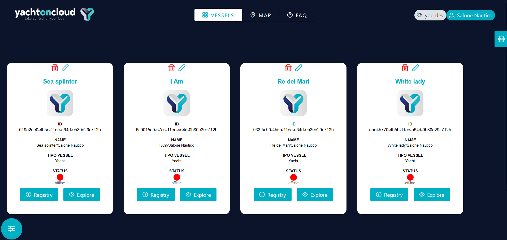

Il bollino `verde` o `rosso` delle card rappresentanti i vessel indicherà rispettivamente una imbarcazione online (raggiungibile) o offline (non raggiungibile). 

Cliccando sul tasto `Registry`, apparirà la card che contiene le informazioni principali del vessel. E' possibile, inoltre, poter vedere in anteprima e scaricare un file che contiene le informazioni dei relativi sensori.

    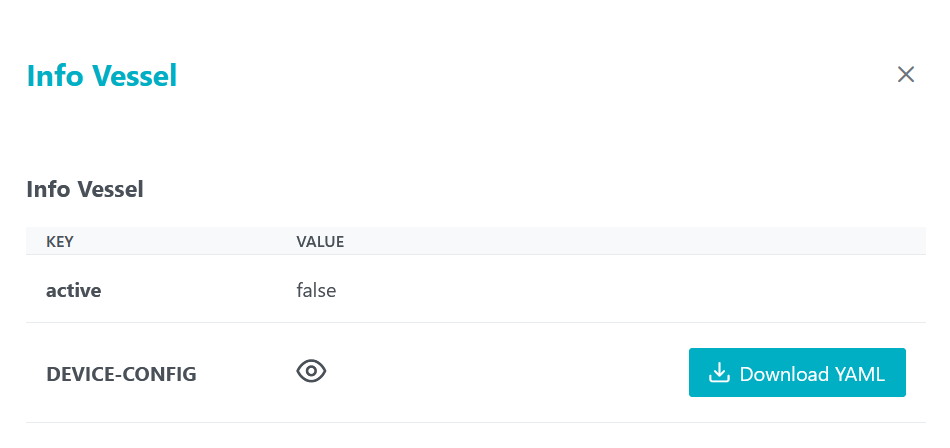

Il tasto `Explore`, invece, reindirizza alla pagina **Vessel Dashboard**.

## Vessel Dashboard

    

### 1. Boat Info

La dashboard si presenta in questo modo. 

In alto troveremo le informazioni riguardanti l'imbarcazione: 

* Il nome e la tipologia della propria imbarcazione: `Yatch`, `Catamarano` , `Dinghi` o `Sailboat`.
* Lo stato dell'imbarcazione: Se essa è raggiungibile o meno: `Attivo` o `Non attivo`.
* Se risulta armata oppure no: `Armed` o `Disarmed`.
* Se risulta ancorata oppure no: `Anchored` o `Unanchored`.

Lo stato di entrambe le operazioni di ormeggio sono modificabili cliccando sul tasto corrispondente.

    
    

L'immagine centrale cambierà in base alla `tipologia` di imbarcazione di cui siamo in possesso. 

In caso non sia presente un evento allarmante riguardante l'imbarcazione, o la barca risulta disarmata prima che sia scattato l'allarme, lo sfondo apparirà `blu` e le icone relative ad esse `verdi`.

In caso sia presente un evento allarmante riguardante l'imbarcazione che risulta armata, lo sfondo alle spalle sarà `rosso`, così come le icone relative ad esse.

    
    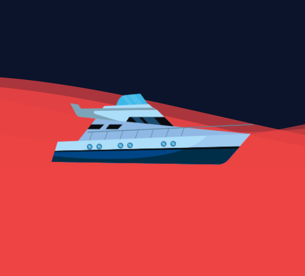

Lungo la destra è presente un menù laterale con 3 bottoni che ci consentono di:

 * Far apparire la card relativa allo stato dei motori se si clicca sul tasto `Engines`.
 * Far apparire la card relativa ai valori dei sensori ambientali ed allo stato degli allarmi se si clicca sul tasto `Alarms`.

    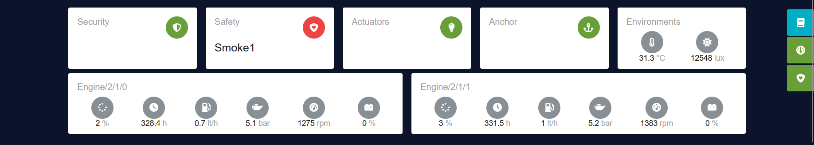

* Far apparire la card relativa alle info del vessel se si clicca sul tasto `Registry`.

    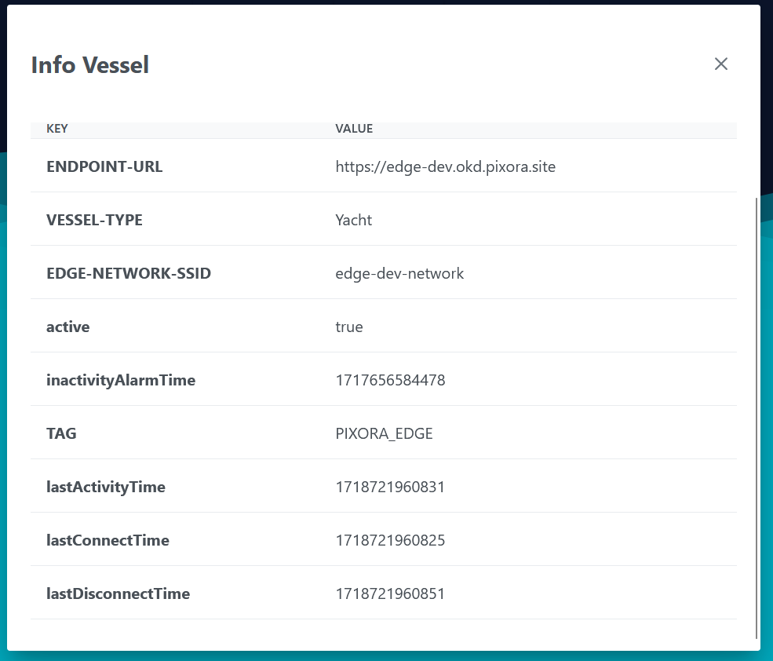

### 2. Menu Rapido

Lungo la sinistra dello schermo, invece, è disponibile un menù rapido.

    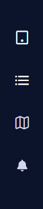

In questo menu è possibile visionare le informazioni relative alla dashboard principale, device, mappa e allarmi: `Home, Devices, Map, Alarm`.

Ogni pulsante del menu reindirizzerà l'utente verso una sezione specifica di cui tratteremo in seguito. **[(Dashboard Devices)](#dashboard-devices)**, **[(Dashboard Alarms)](#dashboard-alarms)**, **[(Tracking Page)](#tracking-page)**. 

## Dashboard Devices

Per poter visualizzare i dispositivi disponibili per la nostra imbarcazione è necessario utilizzare il `Menu Rapido` per andare ad analizzare la macrocategoria di dispositivi a cui siamo interessati, cliccando sul pulsante "Devices" (raffigurato da un icona apposita) che farà apparire una schermata con tutti i dispositivi.

Cliccando sull'icona per visualizzare tutti i dispositivi avremo questa schermata.

    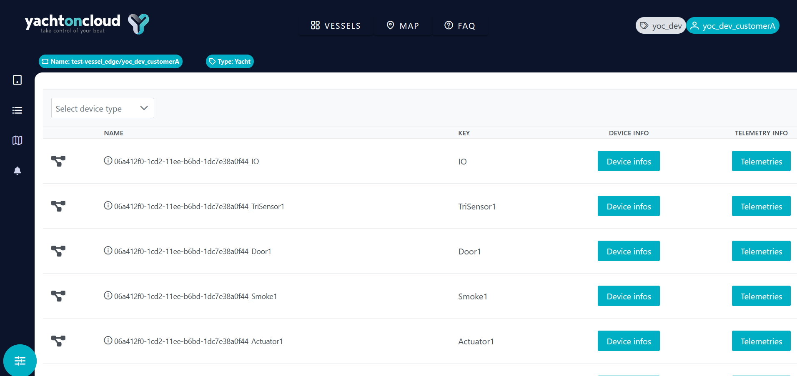

Ogni riga che troviamo in questa schermata corrisponde ad un device, ogni device ha la sua pagina con i relativi dettagli.

Accanto a ciascun dispositivo compare anche un pulsante che consentirà di accedere alla sezione *Telemetries* per la visualizzazione tutte le telemetrie per una più completa ricerca. **[(Vedi Telemetries Card)](#2-telemetries-card)**.

Infine è possibile filtrare la lista di dispositivi presenti per tipo di dispositivo.

*Questi funzionamenti sono uguali per tutti i dispositivi.*

### 1. Device infos Card

Cliccando sul pulsante `Device infos`, apparirà la card *info device* che serve per consultare le informazioni di un determinato dispositivo.

E' costituita da una coppia chiave-valore che consente di poter avere dettagli più precisi circa le caratteristiche del dispositivo, come ad esempio la temperatura che, nel dispositivo di cui sotto, è espressa in gradi Celsius.

    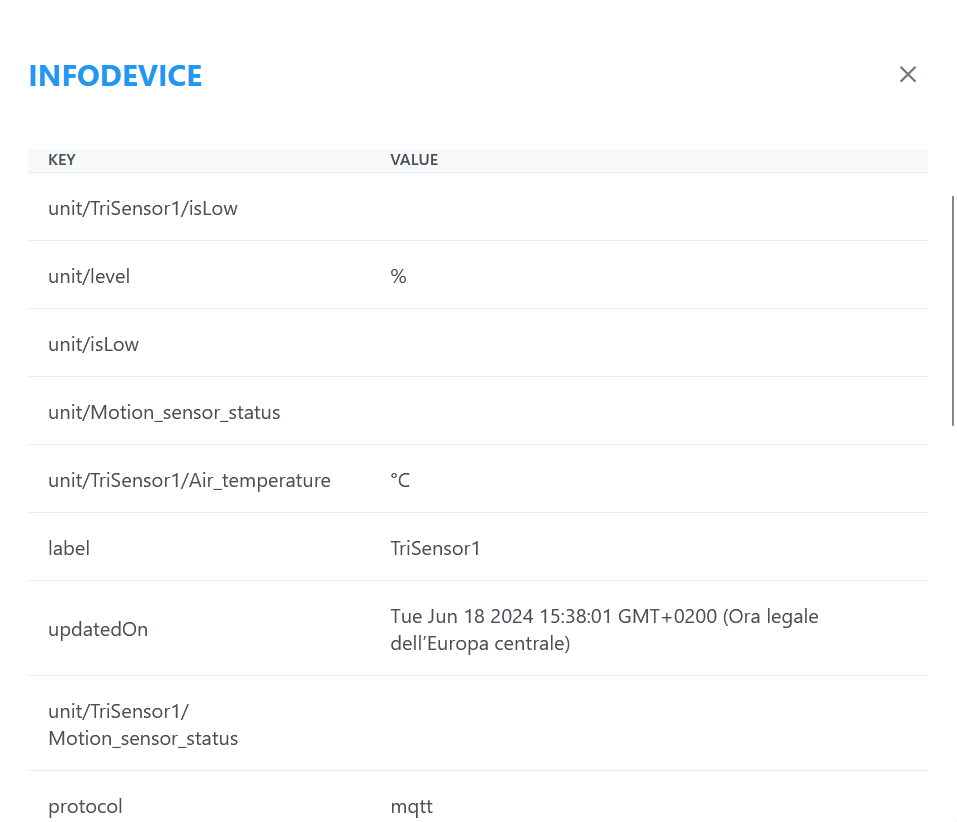

### 2. Telemetries Card

Cliccando sul pulsante `Telemetries` apparirà la card *Telemetry* che serve per monitorare i dati dei dispositivi.

    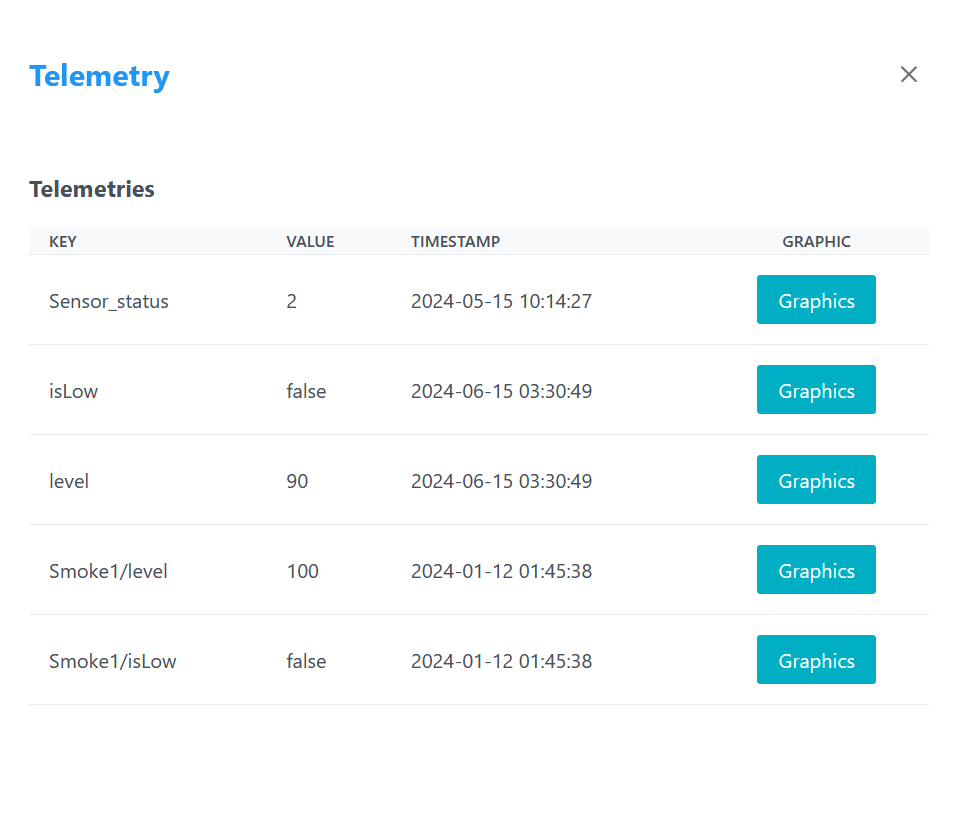

* **Key** = Rappresenta il dato.
* **Value** = Rappresenta il valore del dato.
* **Timestamp** = Rappresenta la marca temporale che accerta l'avvenimento dell'ultimo evento.
 * **Graphic** = Rappresenta un grafico delle ultime telemetrie di un dato.

 Il pulsante `Graphics` farà apparire una card che rappresenta visivamente le ultime telemetrie durante un arco temporale.

 

    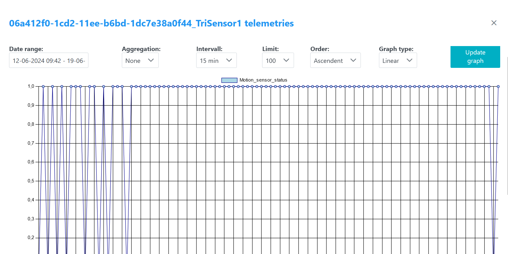

Oltre alla visualizzazione di default del grafico, è possibile impostare dei filtri per avere un grafico personalizzato.

##  Dashboard Alarms

Dal `Menu Rapido` è possibile, cliccando sull'apposita icona (rappresentata da una **campanella**), visualizzare la schermata relativa agli allarmi.

Dalla dashboard possiamo capire quale dispositivo ha fatto scattare un allarme indicando data e orario, il tipo di allarme, la gravità ed il suo stato.

    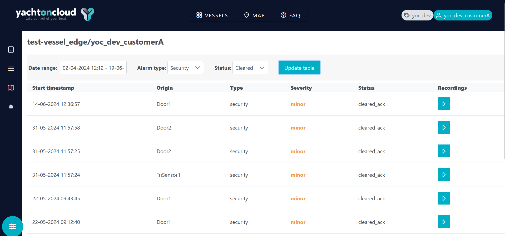

E' disponibile la funzionalità che consente di poter applicare dei filtri per ottenere una lista di allarmi personalizzata impostando un data range, tipo e stato di allarme. 

Vi è la possibilità, cliccando sul bottone apposito, di andare a visualizzare le registrazioni delle telecamere durante gli allarmi.

### 1. Registrazioni

Al momento della ricezione di un allarme, le telecamere inizieranno a registrare. Il sistema consente di poter visualizzare i video registrati.

    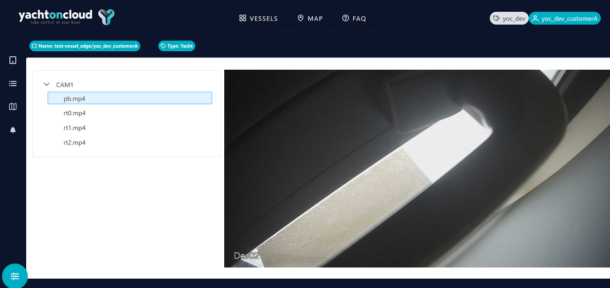

Lungo il lato sinistro della schermata è possibile visualizzare la lista delle telecamere disponibili, al cui interno è possibile consultare il video registrato durante l'allarme, tagliato in vari frammenti.

## Tracking Page

All'interno del `Menu rapido` è possibile, cliccando sull'apposita icona (rappresentata da una **Mappa**), il tracking in tempo reale su una mappa della propria imbarcazione.

    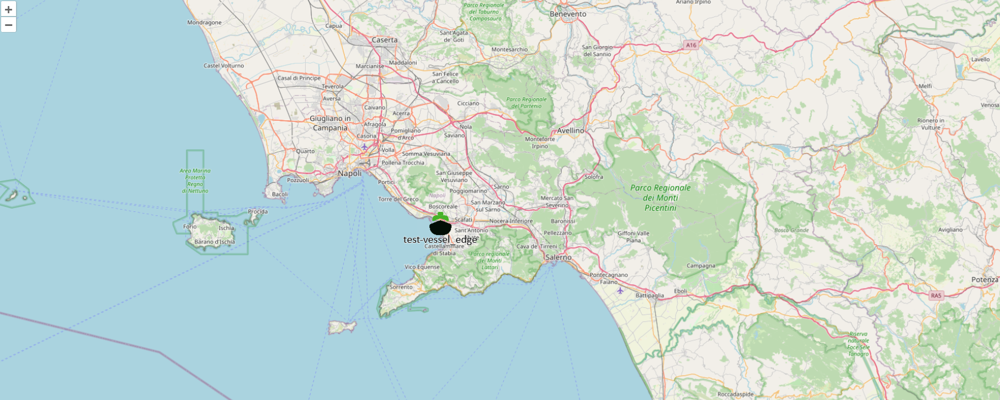

Cliccando sull'icona delle impostazioni sarà possibile vedere i vessel online, quelli offline o entrambi.

##  F.A.Q

In questa pagina l’utente potrà leggere le `F.A.Q` (domande frequenti), e richiedere assistenza tramite le apposite informazioni di contatto. 

    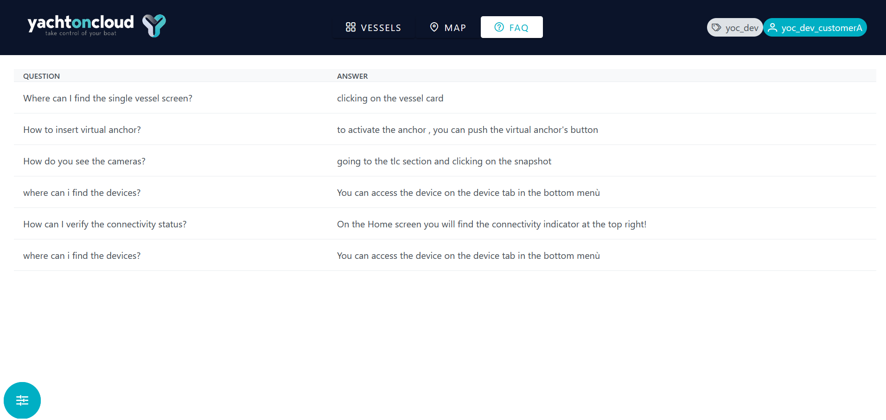

## Logout

Cliccando sul bottone in basso a sinistra posto su tutte le schermate dell'app, l'utente potrà effettuare il Logout e verrà, quindi, riportato alla schermata di Login dove potrà inserire di nuovo le credenziali di accesso. 